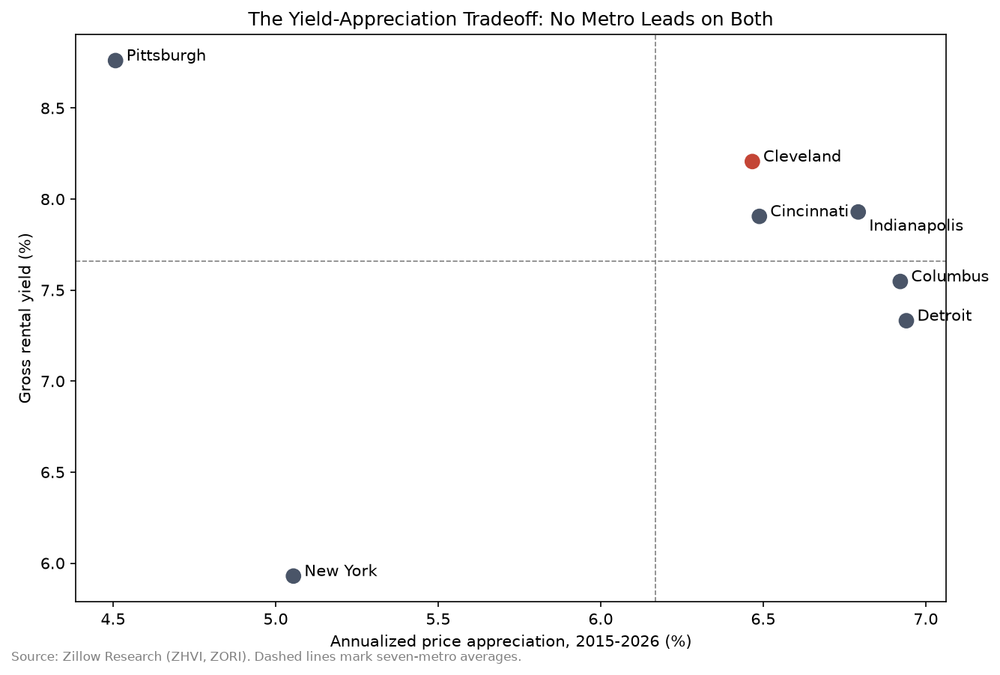

# Multi-Metro Residential Real Estate Comparison

Which US metros suit which residential investment objectives — and why no single metro wins on every dimension.

## The question

For an investor deploying capital in single-family residential, metros differ on three tradeoffs that actually govern the decision: **income yield**, **price appreciation**, and **price risk**. This project compares seven metros — Cleveland, Columbus, Cincinnati, Indianapolis, Pittsburgh, Detroit, and New York — across all three, using public data from January 2015 to June 2026.

## Findings

| Objective | Metro | Rationale |
|---|---|---|
| **Yield-focused** | Pittsburgh | Highest gross yield (8.8%); holds up on a risk-adjusted basis |
| **Appreciation-focused** | Detroit | Highest CAGR (6.9%), but in the highest-volatility tier |
| **Balanced** | Cleveland / Cincinnati | Best yield-per-unit-of-risk; separation between them is thin |
| **Benchmark** | New York | Lowest yield (5.9%) and lowest volatility; included for contrast, not as a recommendation |

**The core tradeoff is real and visible.** Pittsburgh leads on yield and trails badly on appreciation (4.5% CAGR). Detroit is the inverse. Only Cleveland, Cincinnati, and Indianapolis sit above the seven-metro average on both.

**Growth diverged after 2020.** Detroit and Pittsburgh tracked each other closely through 2019, then split sharply — Detroit's CAGR advantage comes almost entirely from the post-2020 period, not from steady outperformance.

## Metrics

| Metric | Definition |
|---|---|
| Gross yield | Annualized ZORI rent ÷ ZHVI home value |
| Appreciation | CAGR of ZHVI, Jan 2015 – Jun 2026 |
| Risk | Annualized standard deviation of monthly ZHVI returns |
| Liquidity | Mean sale-to-list ratio, 2024 onward |

## Limitations

Stated plainly, because they affect how the results should be read:

- **Gross yield is not net yield.** It excludes property taxes, insurance, vacancy, maintenance, and capex. Midwest net yields land several points below these figures. The ranking is more reliable than the levels.
- **ZHVI and ZORI cover different home mixes.** Home values are all-homes mid-tier; rents are single-family. The ratio is a comparable proxy across metros, not a precise yield for any one property.
- **Volatility is understated.** These use Zillow's smoothed, seasonally adjusted series, which removes month-to-month noise by design. Relative rankings hold (Indianapolis is ~1.6× as volatile as New York); the absolute figures should not be quoted. Rerunning on the raw ZHVI cut would be the rigorous version.
- **Liquidity showed weak differentiation.** All seven metros fall within 1.4 percentage points on sale-to-list. Included for completeness and demoted from the headline analysis rather than overstated.
- **The New York metro area includes northern New Jersey.** It is a high-cost benchmark, not a like-for-like peer.
- **Different windows by metric.** Yield, appreciation, and risk cover 2015–2026; sale-to-list data begins March 2018 and is measured from 2024 to reflect current conditions.

## Data

All data from [Zillow Research](https://www.zillow.com/research/data/), free for public use with attribution.

- ZHVI — all homes, mid-tier, smoothed, seasonally adjusted, metro level
- ZORI — single-family residence, smoothed, seasonally adjusted, metro level
- Median sale-to-list ratio — all homes, smoothed, metro level

## Repo structure

- data/ — Raw Zillow CSVs and computed summary table
- notebooks/ — metro_analysis.ipynb, full analysis
- charts/ — Exported figures

## Method

Python, pandas, matplotlib. Wide-format Zillow time series reshaped to long format, merged on metro and month, then aggregated into per-metro metrics. Full workflow in the notebook.